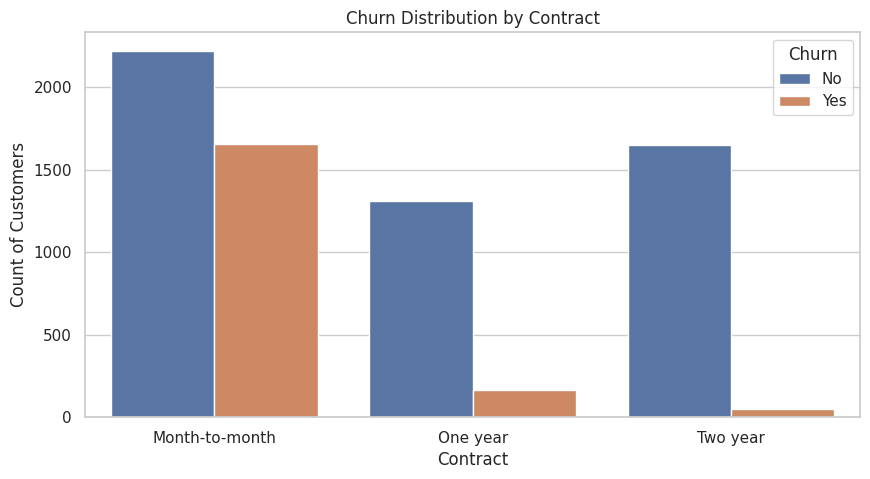
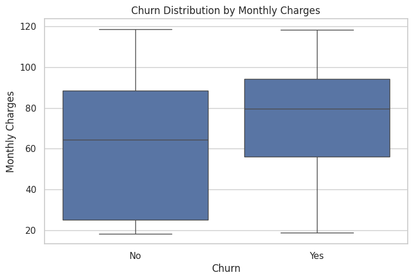
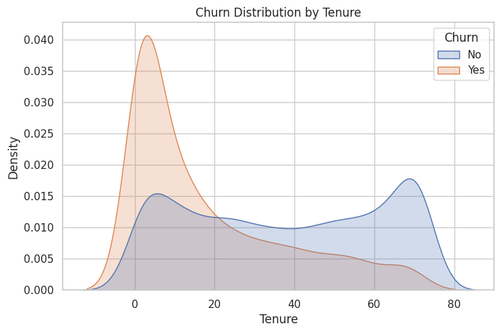
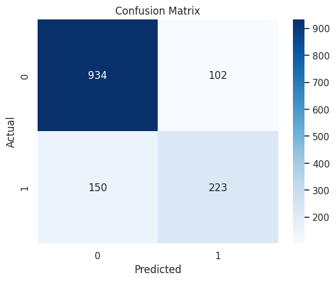
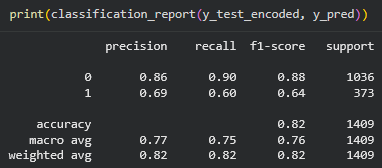

# Customer Churn Prediction Project
## Project Overview
A Telecommunications company is struggling with client retention.  
  
This project focuses on predicting the determining factors of customer churn for a telecommunications business. By identifying why and when clients leave, the business can proactively strategize retention campaigns to protect its customer base and boost revenue.  
  
The aim of the project is to build a predictive model to calculate the probability of client churn and to learn the most influential factors for client churn. This will allow the business to take necessary actions to prevent churn.

## Data Source & Preparation
I used the Telco Dataset containing 7043 rows and 21 variables. The data was inspected which revealed incorrect data types and missing values. I converted the "TotalCharges" column from and object to a numeric format. This column was also missing values, so I imputed these missing values with the median of the training set to prevent data leakage. I removed the unique identifier column "customerID" as this would cause the model to run ineffectively. Furthermore I encoded and scaled the data. I then completed the test/train split and separated the target variable, "Churn".

## Exploratory Data Analysis
I aimed to better understand the data prior to model generation. Visualizing the data helps us in understanding the relationships between our variables.

Based on the Churn distribution per contract type we can see that the majority of the clients who are churning are on the month-to-month contract type.

As per the churn distribution by monthly charges, we can see that Monthly charges heavily impacts the probability of churn. Clients charged a higher set of monthly fees are more likely to churn.

As per the Churn Distribution by Tenure visualization, we can see that the shorter the client tenure the more likely they are to churn.  

This was ultimately a great general overview of the dataset and relationships between the variables.

## Model Generation and Evaluation
I used the prepared data to train a logistic regression model for binary classification. The model determined the probability of client churn.  
The model was evaluated using a confusion matrix, a classification report and the F1-score.

  
Confusion Matrix Results: 934 true negatives, 102 false positives, 150 false negatives, and 223 true positives.  

Based on the Confusion matrix results and the classification report, we can see that the model strikes a moderate balance between precision and recall.  

  The most influential variables are the Contract Type, Monthly Charges and the Tenure.

  ## Business Impact 
  Based on our analysis, it is evident that the business should focus on having clients sign up longer contracts. Clients who remain on month-to-month contracts are at a high risk of churning. The business can also implement strategies to incentivize current month-to-month clients to transition to longer contracts or other tailored retention strategies. Retaining these month-to-month clients will directly reduce revenue leakage.
